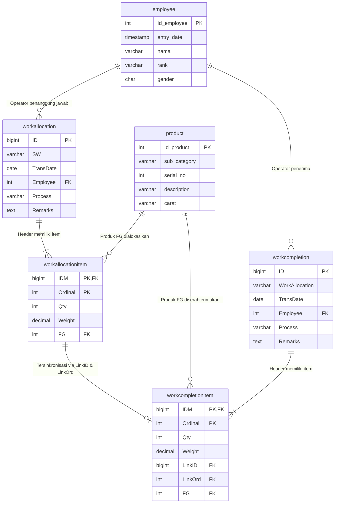

# Sistem Modul Surat Perintah Kerja Operator (SPKO) ERP

Sistem informasi manufaktur terintegrasi untuk pengelolaan **Surat Perintah Kerja Operator (SPKO / Work Allocation)** dan **Nota Terima Hasil Kerja Operator (NTHKO / Work Completion)**. dengan kombinasi teknologi **Laravel (PHP 8.3+)**, **MySQL**, **jQuery**, serta modul analitik terpisah berbasis **Python Flask & Jinja2**.

---

## 📋 Daftar Isi

1. [Fitur Utama & Pemetaan Soal](#-fitur-utama--pemetaan-soal)
2. [Prasyarat Sistem](#-prasyarat-sistem)
3. [Panduan Instalasi & Menjalankan Aplikasi](#-panduan-instalasi--menjalankan-aplikasi)
    - [Setup Database MySQL](#1-setup-database-mysql)
    - [Menjalankan Aplikasi Laravel](#2-menjalankan-aplikasi-laravel)
    - [Menjalankan Modul Python Flask](#3-menjalankan-modul-python-flask)
4. [Pengujian Otomatis (Automated Testing)](#-pengujian-otomatis-automated-testing)
5. [Struktur Database & Relasi](#-struktur-database--relasi)
6. [Panduan Demonstrasi Teknis (Sesi Zoom Meeting)](#-panduan-demonstrasi-teknis-sesi-zoom-meeting)

---

## 🚀 Fitur Utama & Pemetaan Soal

| No      | Modul / Soal                           | Deskripsi Implementasi                                                                                                                                                                                                                                                                                                                                                                                                                                                                      | Stack Teknologi                                 |
| ------- | -------------------------------------- | ------------------------------------------------------------------------------------------------------------------------------------------------------------------------------------------------------------------------------------------------------------------------------------------------------------------------------------------------------------------------------------------------------------------------------------------------------------------------------------------- | ----------------------------------------------- |
| **1**   | **Database & Migrasi (30 Poin)**       | Pembuatan skema database `database_erp`, 6 tabel inti, relasi _foreign keys_, _composite primary keys_, model Eloquent, dan _seeder_ data awal.                                                                                                                                                                                                                                                                                                                                             | Laravel Migrations, MySQL, Eloquent Models      |
| **1.a** | Tabel `employee`                       | Master data operator (`Id_employee`, `entry_date`, `nama`, `rank`, `gender`).                                                                                                                                                                                                                                                                                                                                                                                                               | Laravel Migration & Seeder                      |
| **1.b** | Tabel `product`                        | Master data perhiasan (`Id_product`, `sub_category`, `serial_no`, `description`, `carat`, SKU accessor).                                                                                                                                                                                                                                                                                                                                                                                    | Laravel Migration & Seeder                      |
| **1.c** | Tabel `workallocation`                 | Header Surat Perintah Kerja Operator (`ID`, `Remarks`, `Employee`, `TransDate`, `Process`, `SW`).                                                                                                                                                                                                                                                                                                                                                                                           | Laravel Migration & Seeder                      |
| **1.d** | Tabel `workallocationitem`             | Detail item SPKO (`IDM`, `Ordinal`, `Qty`, `Weight`, `FG`).                                                                                                                                                                                                                                                                                                                                                                                                                                 | Composite PK (`IDM`, `Ordinal`)                 |
| **1.e** | Tabel `workcompletion`                 | Header Nota Terima Kerja (`ID`, `Remarks`, `Employee`, `TransDate`, `Process`, `WorkAllocation`).                                                                                                                                                                                                                                                                                                                                                                                           | Laravel Migration & Seeder                      |
| **1.f** | Tabel `workcompletionitem`             | Detail item serah terima NTHKO (`IDM`, `Ordinal`, `Qty`, `Weight`, `LinkID`, `LinkOrd`, `FG`).                                                                                                                                                                                                                                                                                                                                                                                              | Composite PK & Foreign Key Reference            |
| **2**   | **Modul CRUD & Cetak SPKO (70 Poin)**  | - **Create**: Pembuatan transaksi SPKO + otomatis membuat Nota Terima Kerja (workcompletion) dengan format penomoran unik `SPKO2204001` (Tahun, Bulan, Nomor Urut). Input multi-produk dinamis dengan jQuery.<br>- **Update**: Mengubah jumlah Qty item, mengganti tanggal transaksi, dan mengganti operator secara atomik.<br>- **Delete**: Menghapus transaksi SPKO beserta nota terima kerja terkait.<br>- **Print**: Tampilan cetak resmi 1:1 sesuai spesifikasi halaman 4 dokumen PDF. | Laravel Controller, Blade, Tailwind CSS, jQuery |
| **3**   | **Laporan Harian Raw Query (10 Poin)** | Laporan rekapitulasi komparasi harian SPKO dan NTHKO yang **100% menggunakan Raw SQL Query murni (`DB::select`) tanpa Eloquent ORM**.                                                                                                                                                                                                                                                                                                                                                       | Raw SQL, MySQL, Laravel Controller              |
| **4**   | **Modul Python Flask (20 Poin)**       | Aplikasi analitik terpisah menggunakan Python Flask dan Jinja2 untuk menghitung selisih berat (_shrinkage_ / susut emas) per produk FG antara SPKO dan NTHKO.                                                                                                                                                                                                                                                                                                                               | Python 3.10, Flask 3.1, Jinja2, PyMySQL         |
| **Plus**| **Arsitektur Dashboard & Master Data** | Layout antarmuka modern terintegrasi dengan sidebar navigasi (Dashboard, Master Data Operator & Produk FG, Transaksi SPKO & NTHKO, serta Laporan Analitik) bergaya standar IPM System.                                                                                                                                                                                                                                                                                                       | Tailwind CSS, FontAwesome, Alpine/Vanilla JS    |
| **5**   | **Demonstrasi & Repositori**           | Dokumentasi lengkap alur kerja, git commit terstruktur per nomor soal, dan instruksi demonstrasi Zoom.                                                                                                                                                                                                                                                                                                                                                                                      | Git, Markdown, README                           |


---

## 💻 Prasyarat Sistem

- **PHP**: Versi 8.2 atau 8.3+ (CLI & Web)
- **Composer**: Versi 2.x
- **MySQL / MariaDB**: Port default 3306 (misalnya via XAMPP / Laragon)
- **Python**: Versi 3.8+ (direkomendasikan Python 3.10+)
- **Git**: Untuk manajemen repositori

---

## 🛠️ Panduan Instalasi & Menjalankan Aplikasi

### 1. Setup Database MySQL

Pastikan service MySQL aktif, lalu buat database:

```sql
CREATE DATABASE database_erp CHARACTER SET utf8mb4 COLLATE utf8mb4_unicode_ci;
```

### 2. Menjalankan Aplikasi Laravel

1. Buka terminal pada folder proyek:
    ```bash
    cd c:\xampp\htdocs\surat_perintah_kerja_operator-SPKO-
    ```
2. Salin environment file jika belum ada:
    ```bash
    copy .env.example .env
    ```
3. Pastikan konfigurasi database di file `.env` sudah sesuai:
    ```env
    DB_CONNECTION=mysql
    DB_HOST=127.0.0.1
    DB_PORT=3306
    DB_DATABASE=database_erp
    DB_USERNAME=root
    DB_PASSWORD=
    ```
4. Jalankan migrasi dan seeder awal data Soal 1:
    ```bash
    php artisan migrate:fresh --seed
    ```
5. Jalankan server Laravel:
    ```bash
    php artisan serve --port=8000
    ```
6. Akses melalui browser:
    - **Dashboard SPKO (CRUD & Cetak)**: [http://127.0.0.1:8000/spko](http://127.0.0.1:8000/spko)
    - **Laporan Harian Raw Query (Soal 3)**: [http://127.0.0.1:8000/reports/daily-spko-nthko](http://127.0.0.1:8000/reports/daily-spko-nthko)

---

### 3. Menjalankan Modul Python Flask (Soal 4)

1. Buka terminal baru dan masuk ke folder `python_flask`:
    ```bash
    cd c:\xampp\htdocs\surat_perintah_kerja_operator-SPKO-\python_flask
    ```
2. Pasang dependensi yang dibutuhkan:
    ```bash
    pip install -r requirements.txt
    ```
3. Jalankan aplikasi Flask:
    ```bash
    python app.py
    ```
4. Akses melalui browser:
    - **Modul Selisih Berat FG (Flask & Jinja2)**: [http://127.0.0.1:5000](http://127.0.0.1:5000)
    - **Rincian Transaksi Produk FG**: [http://127.0.0.1:5000/detail/128409](http://127.0.0.1:5000/detail/128409)

---

## 🧪 Pengujian Otomatis (Automated Testing)

### Pengujian Fitur Laravel (PHPUnit)

Memvalidasi seluruh alur Create, Read, Update, Delete, Print, dan Raw Query:

```bash
php artisan test
```

_Hasil: Seluruh pengujian lulus (Passed)._

### Pengujian Modul Python Flask (Unittest)

Memvalidasi rendering Jinja2, kalkulasi selisih berat FG, dan penanganan error 404:

```bash
cd python_flask
python -m unittest test_app.py
```

_Hasil: Seluruh 4 pengujian lulus (OK)._

---

## 🗄️ Struktur Database & Relasi


